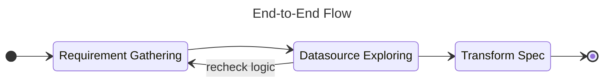

# Data Modeling

A Data modeling document for any business data store.

!!! note

    This project will focus on the data modeling knowledge and implementation.

The flow before implementation data modeling.

## Transform Spec

A table structure for keeping transformation spec for any transform that use
on the ETL/ELT process.

## Metadata

A metadata keeps all schema structure of any data that able to store.

### Domain

### Structure

## Control Framework
