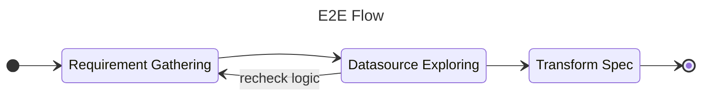

# Data Modeling

A Data modeling document for any business data store.

!!! note

    This project will focus on the data modeling knowledge and implementation.

The end-to-end flow before implementation step.

## Metadata

### Domain

### Transform Spec

The table structure for keeping transformation spec for any transform that use
on the ETL/ELT process.

### Control Framework
